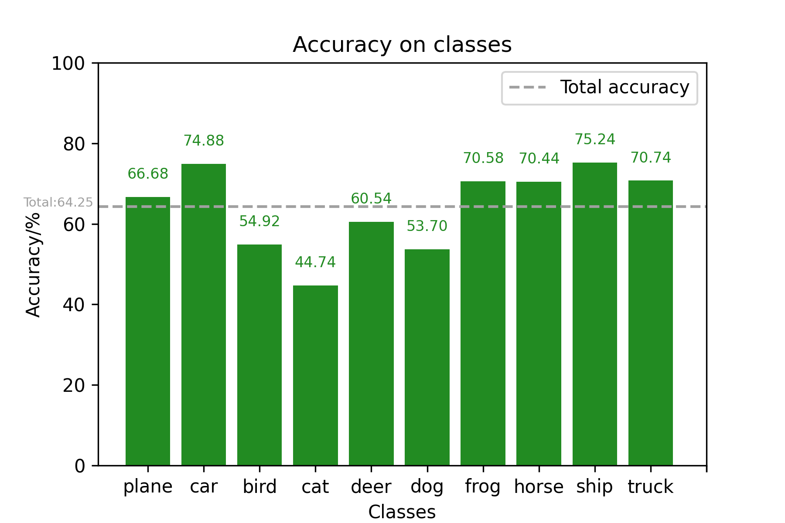
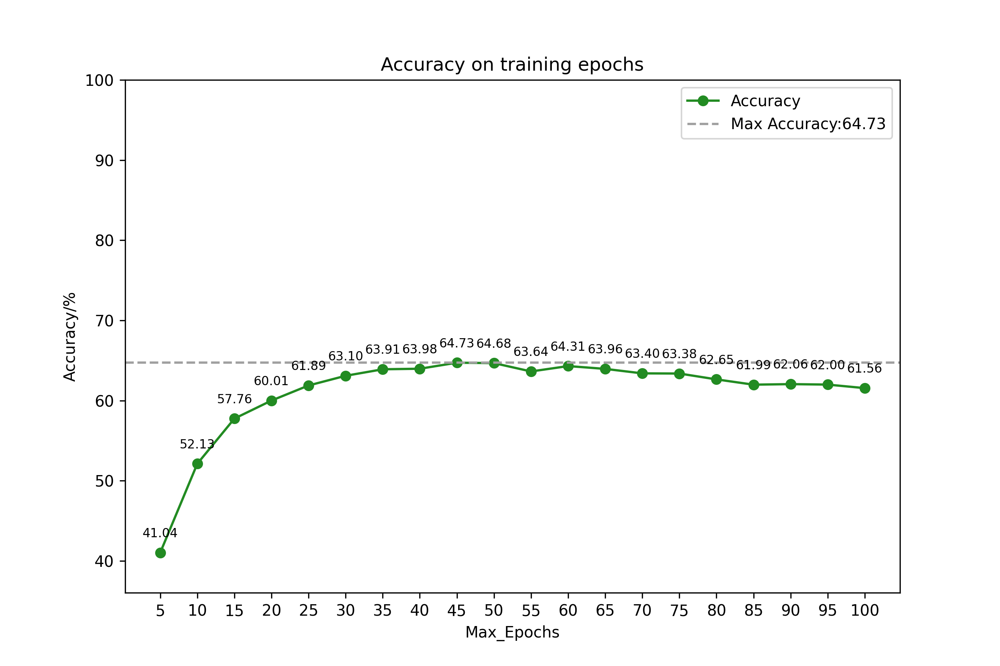
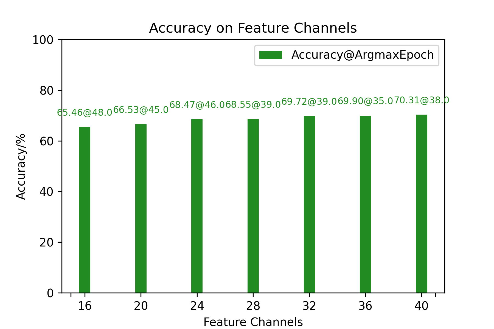
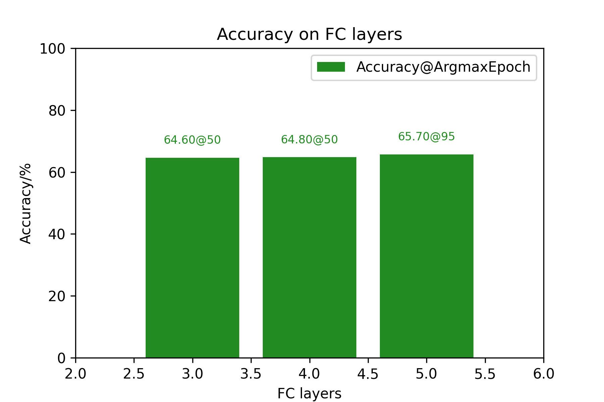

# 基于PyTorch的LeNet-5实现

211250143 王铭嵩 2023fall机器学习小作业

## 一、神经网络基本原理

卷积神经网络主要由卷积层、池化层、全连接层构成。卷积层通过对输入图像进行卷积操作来提取图像特征。池化层对输入的特征图片进行压缩，简化网络计算复杂度。全连接层连接所有的特征，并将输出值送给分类器。

## 二、LeNet-5基本结构

### 1.输入层

用以接收输入的图像数据。在CIFAR10数据集上，输入为32x32x3的图像数据。图像长宽为32，以及RGB三个颜色通道。

### 2.卷积层1

卷积层1包括6个卷积核，每个卷积核大小为5x5，步长为1，填充为0，输出6个通道的28x28的特征图

### 3.采样层1

采样层1采用最大池化操作，窗口大小为2x2，步长为2.每个池化操作从2x2的窗口中选择最大值，输出6个通道的14x14的特征图。采样层可减少特征图大小，并对于轻微的位置变化保持不变性。

### 4.卷积层2

卷积层2包括16个卷积核，每个卷积核大小为5x5，步长为1，填充为0.输出16个通道的10x10的特征图

### 5.采样层2

操作同采样层1，输出16个通道的5x5的特征图

### 6.全连接层1

全连接层1将每个通道的特征图拉伸为一维向量（16x5x5），并通过带有120个神经元的全连接层连接。120为设计者根据实验得到的最佳值。

### 7.全连接层2

全连接层2将120个神经元连接到84个神经元。84为设计者根据实验得到的最佳值。

### 8.输出层

输出层由10个神经元组成，对应10组图片分类，并输出最终的分类结果。

## 三、PyTorch代码实现

- LeNet类初始化：将各层作为成员变量存储。
  
  ```python
  def __init__(self,
          channel1=CHANNEL_1, # 卷积层1的卷积核数量。默认为6
          channel2=CHANNEL_2, # 卷积层2的卷积核数量。默认为16
          fc_count=FC_COUNT): # 全连接层数量，默认为3
      super(LeNet5, self).__init__()  # 父类构造方法
      self.conv1 = nn.Conv2d(3, channel1, 5,1,0) # 卷积层1
      self.pool = nn.MaxPool2d(2, 2)  # 采样层
      self.conv2 = nn.Conv2d(channel1, channel2, 5, 1, 0) # 卷积层2
      self.fc1=nn.Linear(channel2 * 25, 120) # 全连接层1
      self.fc2=nn.Linear(120, 84) # 全连接层2
      self.fc=[]  # 为更多全连接层预留
      for i in range(fc_count-3):
          self.fc.append(nn.Linear(84,84))
      self.fc3=nn.Linear(84, 10) # 全连接层3
  ```

- 前向传播：使用激活函数
  
  ```python
  def forward(self, x):
      x = self.pool(Func.relu(self.conv1(x)))
      x = self.pool(Func.relu(self.conv2(x)))
      x = x.view(-1, self.channel2 * 25)
      x = Func.relu(self.fc1(x))
      x = Func.relu(self.fc2(x))
      for i in range(len(self.fc)):
          x = Func.relu(self.fc[i](x))
      x = self.fc3(x)
      return x
  ```

- 训练代码：
  
  ```python
  def train(self,  max_epochs=MAX_TRAIN):
      criterion = nn.CrossEntropyLoss()   # 以交叉熵损失作为标准
      optimizer = optim.SGD(self.parameters(), lr=0.001, momentum=0.9)
      for epoch in range(max_epochs):
          running_loss = 0.0
          for i, data in enumerate(TRAIN_LOADER, 0):
              inputs, labels = data
              optimizer.zero_grad()
              outputs = self.forward(inputs)
              loss = criterion(outputs, labels)
              loss.backward()
              optimizer.step()
              running_loss += loss.item()
  ```

- 测试代码：
  
  ```python
  def test(self,test_loader=TEST_LOADER):
      accuracies=[]
      class_correct = list(0. for _ in range(10)) # 以十个结果类分别创建列表
      class_total = list(0. for _ in range(10))
      with torch.no_grad():
          for data in test_loader:
              inputs, labels = data
              outputs = self(inputs)
              _, predicted = torch.max(outputs, 1)
              c = (predicted == labels).squeeze()
  
              for i in range(len(labels)):    # 以类为依据更新结果
                  label = labels[i]
                  class_correct[label] += c[i].item()
                  class_total[label] += 1
      for i in range(10): # 类正确率格式：(类名:string, 正确率:number)
          accuracies.append((CLASSES[i],class_correct[i]*100.0/class_total[i]))
      total_accuracy=sum(class_correct)*100.0/sum(class_total)
      return total_accuracy,accuracies    # 返回总正确率和各类正确率
  ```
  
  ## 四、实验结果截图
  
  > 说明：精度为5次训练取平均
  
  ### 1.默认LeNet-5结构精度：
  
  
  
  ### 2.调整后的模型精度：
  
  

### 3.训练次数与精度关系：



### 4.卷积层输出通道数与精度关系：

横轴为卷积层2的输出通道数(channel_2)，卷积层1的输出通道数为:

$$
channel\_1=6+(channel\_2-16)\div2
$$



### 5.全连接层数与精度关系：



# 参考资料

[卷积神经网络——输入层、卷积层、激活函数、池化层、全连接层-CSDN博客](https://blog.csdn.net/yjl9122/article/details/70198357)

[卷积神经网络经典回顾之LeNet-5](https://zhuanlan.zhihu.com/p/616996325)